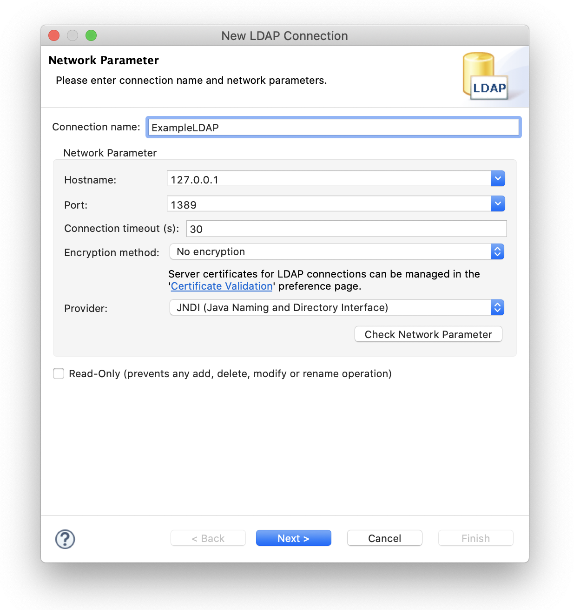
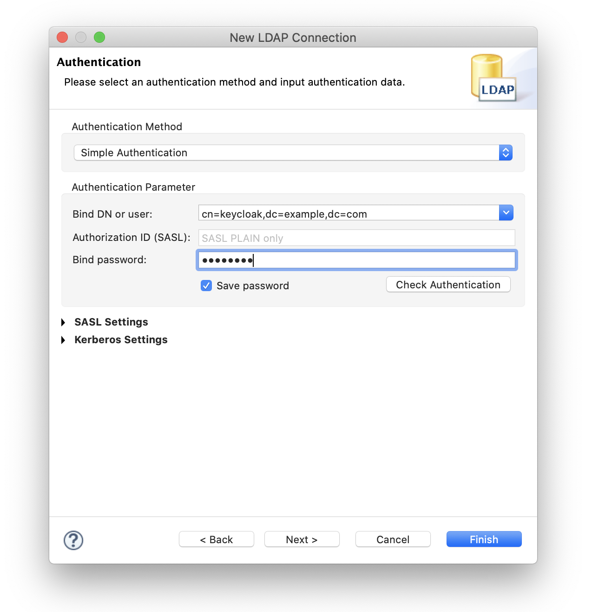
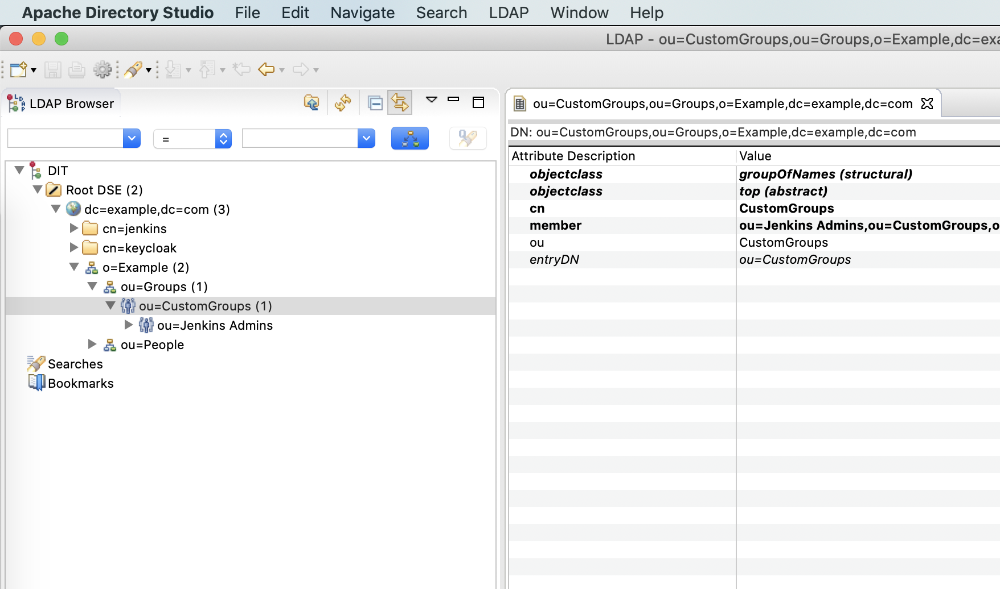

# Virtual-LDAP

Virtual-LDAP is a service used to bridge any other account services to the LDAP protocol. With Virtual-LDAP, you can use existing account services (such as DingTalk) as an authorization service for many open source projects.

Virtual-LDAP has a provider architecture, so you can extend it with a custom provider to support any other account service, such as a database-based account service.

Virtual-LDAP is not a complete implementation of LDAP and currently only supports partial binding, search, and modification requests. All directory groups and users will be obtained from the provider.

The database used for Virtual-LDAP is used to store user passwords. Passwords will be hashed using SHA256 plus a salt value.


## Configuration

Virtual-LDAP using JavaScript to configure all settings, include DN, admins, database, provider and custom groups.

For every configuration items, see example config file below.

```javascript
module.exports = {
    ldap: {
        // LDAP serve port, it is a insecure port, please connect with ldap://
        listenPort: 1389,
        // Base DN will be o=Example,dc=example,dc=com
        // Groups base DN will be ou=Groups,o=Example,dc=example,dc=com
        // Users base DN will be ou=People,o=Example,dc=example,dc=com
        rootDN: 'dc=example,dc=com',
        organization: 'Example',
        // Default password for ldap user, Random password will be generated if not set
        userPassword: 'userPass',
        // Cronjob for sync from dingtalk(default every hour)
        cronJob: '0 0 * * *',
        // Timezone for cronjob(default UTC+8 GMT+8 Asia/Shanghai China Standard Time)
        timeZone: 'Asia/Shanghai',
        // Admins who can search or modify directory
        admins: [
            {
                // Bind DN will be cn=keycloak,dc=example,dc=com
                commonName: 'keycloak',
                password: 'keycloak',
                // Can this admin modify user's password
                canModifyEntry: true,
            },
            {
                commonName: 'jenkins',
                password: 'jenkins',
                canModifyEntry: false,
            },
        ]
    },
    // Database for storing users' password
    database: {
        type: 'mysql',
        host: '127.0.0.1',
        port: '23306',
        user: 'root',
        password: '123456',
        database: 'vldap',
    },
    // Provider for providen account service, Create Apps by https://open-dev.dingtalk.com/fe/app#/corp/app
    provider: {
        name: 'dingtalk',
        appKey: '__APPKEY__',
        appSecret: '__APPSECRET__',
    },
    // Custom groups, base DN will be ou=CustomGroups,ou=Groups,o=Example,dc=example,dc=com
    customGroups: [
        {
            // DN will be ou=Jenkins Admins,ou=CustomGroups,ou=Groups,o=Example,dc=example,dc=com
            name: 'Jenkins Admins',
            // User with these mails will be added to the group
            members: [ 'jenkins@example.com' ],
        }
    ]
}

```

## Configuration Dingtalk Management Console

[钉钉开放后台 -> 应用开发 -> 企业内部应用 -> 钉钉应用 -> 创建应用(类型:小程序,开发方式:企业自主研发)](https://open-dev.dingtalk.com/fe/app#/corp/app)

`基础信息` -> `应用信息` -> Copy `AppKey` and `AppSecret`

`基础信息` -> `权限管理` -> `通讯录管理` -> `grant readonly permission`

## LDAP DN

For Virtual-LDAP using the above configuration file, the commonly used DNs are as follows.

**Root DN**

`dc=example,dc=com`

**Search Directory Bind DN**

`cn=keycloak,dc=example,dc=com`

**Groups Base DN**

`ou=Groups,o=Example,dc=example,dc=com`

**Users Base DN**

`ou=People,o=Example,dc=example,dc=com`

**Custom Groups Base DN**

`ou=CustomGroups,ou=Groups,o=Example,dc=example,dc=com`

**Jenkins Admins DN**

`ou=Jenkins Admins,ou=CustomGroups,ou=Groups,o=Example,dc=example,dc=com`

**Typical User DN**

`mail=user@example.com,ou=People,o=Example,dc=example,dc=com`


## Run Virtual-LDAP

Virtual-LDAP can run from source or run as a service in another project.

### Run from source

```bash
git clone https://github.com/ohdarling/virtual-ldap
cd virtual-ldap
npm start
```

### Run as a service

```javascript
const server = require('virtual-ldap');
server.setupVirtualLDAPServer(require("./config"));
server.runVirtualLDAPServer();
```


## Testing with ApacheDirectoryStudio






## License

MIT License
